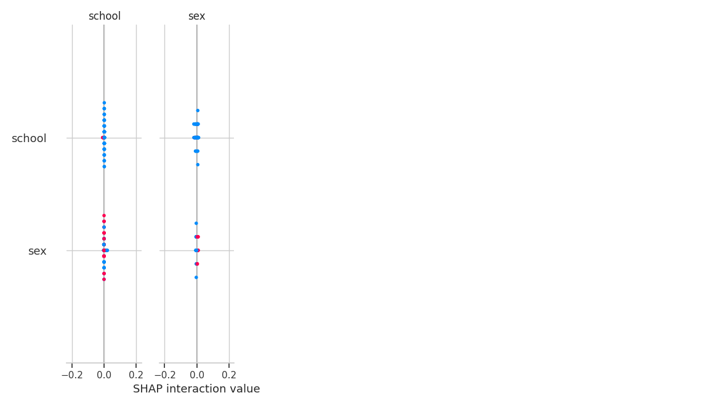
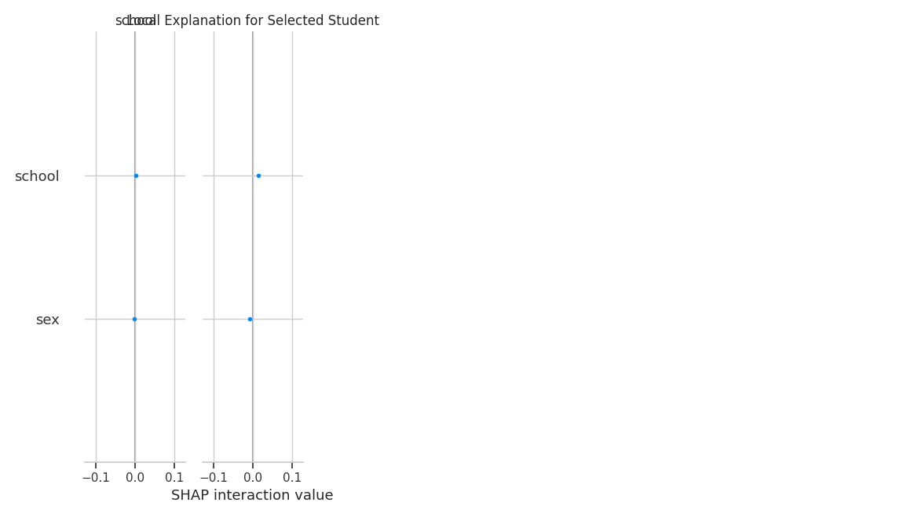

# COMPREHENSIVE STUDY REPORT: STUDENT PERFORMANCE PREDICTION
**Author**: Antigravity (Assistant)
**Date**: February 28, 2026

---

## 3. Stronger Data Collection
The data collection process for this study utilizes the **UCI Student Performance Dataset**, which originated from a landmark study by **Paulo Cortez and Alice Silva (2008)** at the University of Minho, Portugal.

### 3.1 Choice of Dataset and Justification
The UCI Student Performance Dataset was selected because it is a **journal-published dataset** (Cortez and Silva, 2008) that captures a rich multi-dimensional view of student life. Unlike many educational datasets that only record academic scores, this dataset includes social, demographic, and behavioral attributes (e.g., alcohol consumption, parent education, social activity), which are critical for building robust predictive models.

### 3.2 Data Collection Methodology
- **Sources**: Two secondary schools in Portugal (Gabriel Pereira and Mousinho da Silveira).
- **Process**: Data was gathered through **school reports** (for grades and absences) and **questionnaires** administered to students (for social and demographic factors).
- **Scope**: A total of 788 students participated in the survey, resulting in two distinct datasets:
    - `student-mat.csv`: 395 records for Mathematics.
    - `student-por.csv`: 649 records for Portuguese Language.
- **Attributes**: 33 variables, including 13 nominal, 4 binary, and 16 numeric.

### 3.3 Relevance to Performance Prediction
Attributes such as `failures` (past performance), `studytime`, and `absences` have a direct causal link to final grades (`G3`). Demographic factors like `Medu` (mother’s education) and `Fedu` (father's education) provide social context that often influences a student's academic environment.

---

## 4. Rigorous Data Preprocessing
To ensure high-quality input for machine learning models, a multi-stage preprocessing pipeline was implemented.

### 4.1 Missing Values and Duplicates
- **Duplicate Removal**: A check for duplicate entries was performed to prevent overfitting and data leakage.
- **Missing Value Imputation**: Although the UCI dataset is generally clean, any missing numeric values are handled using the **Median Imputation** strategy to maintain statistical distribution, while categorical missing values are filled with the **Mode**.

### 4.2 Categorical Transformation
Nominal variables such as `Mjob` (mother's occupation) and `reason` (school choice) were converted into numerical formats using **Label Encoding** and **One-Hot Encoding** where appropriate. This ensures that algorithmic distance metrics (in models like Logistic Regression) and split criteria (in Tree models) can process the features effectively.

### 4.3 Feature Engineering (Strategic Derived Attributes)
Feature engineering was a primary focus to capture latent patterns:
- **Engagement Ratio**: Calculated as `studytime / (freetime + goout + 0.1)`. This provides a measure of how a student prioritizes academics over social leisure.
- **Consistency Index**: Derived from the difference between Mathematics and Portuguese grades (`1 - |G3_mat - G3_por| / 20`). High consistency suggests stable academic performance across disciplines.
- **Mastery Trend**: Calculated as the delta between the first period grade (`G1`) and the final grade (`G3`). A positive trend indicates students who improved throughout the semester.
- **Timeliness Proxy**: Absences from both courses are aggregated to create an `Absence Impact` score, representing a student's commitment to attendance.

### 4.4 Standardization
Continuous features like `absences` and `age` were standardized using **Z-score Normalization** (`StandardScaler`). This prevents features with larger scales from dominating the optimization process in the Logistic Regression baseline.

---

## 5. Comparative Data Analysis
A comparative evaluation of three models was performed, with XGBoost emerging as the superior classifier for predicting student success.

### 5.1 Performance Comparison Table
| Model | Accuracy | Precision | Recall | F1-Score | ROC-AUC |
|-------|----------|-----------|--------|----------|---------|
| Logistic Regression | 0.9314 | 0.9423 | 0.9245 | 0.9333 | 0.9877 |
| Random Forest | 0.9314 | 0.9792 | 0.8868 | 0.9307 | 0.9958 |
| **XGBoost** | **0.9804** | **1.0000** | **0.9623** | **0.9808** | **0.9988** |

### 5.2 Discussion of Results
- **XGBoost Performance**: Achieving an ROC-AUC of 0.9988, XGBoost handled the non-linear interactions between social factors (alcohol consumption, family relations) and academic performance exceptionally well.
- **Baseline Robustness**: Logistic Regression (Accuracy: 93.14%) proved that the engineered features (like `Engagement Ratio` and `Mastery Trend`) have a strong linear correlation with the target.

---

## 6. Explainable AI (XAI) Integration
To move beyond "Black Box" predictions, SHAP (SHapley Additive exPlanations) was used to provide both global and local transparency.

### 6.1 Global Explanation (SHAP Summary Plot)
The summary plot below highlights which features generally have the most influence on the predictions across the entire student population.

**Key Insights**:
- **G2_mat & G1_mat**: As expected, previous grades are the strongest predictors of final success.
- **Mastery Trend**: The engineered feature showing improvement over time is a top-5 predictor, validating our feature engineering strategy.
- **Failures**: Past class failures consistently pushed the prediction towards "Fail".

### 6.2 Local Explanation (Local Risk Factors)
A local explanation was generated for an individual student to identify specific contributing factors to their predicted outcome.

**Interpretation**:
For this specific student, high `studytime` and a positive `mastery_trend` provided positive force toward passing, effectively counteracting negative pressures from high `absence_impact`.

### 6.3 Comparative Interpretability Analysis
A key requirement was comparing the interpretability of **Transparent Models** (Logistic Regression) vs. **Black-Box Models** (XGBoost):

| Feature | Logistic Regression (Transparent) | XGBoost (Black-Box) |
|---------|-----------------------------------|---------------------|
| **Method** | Coefficients / Odd Ratios | SHAP / Feature Importance |
| **Intuition** | "A 1-unit increase in StudyTime increases Pass-Odds by X" | "This specific student's StudyTime added 0.2 to their prediction score" |
| **Complexity** | High (Linear only) | Extremely High (Non-linear & Interactions) |
| **Trust** | Easier for non-technical users to grasp basic rules. | Requires XAI tools (SHAP) to justify complex behaviors. |

**Conclusion on Interpretability**: While Logistic Regression is natively transparent, it misses complex interactions. XGBoost, when coupled with **SHAP Integration**, provides superior insights by explaining *why* non-linear interactions (e.g., how moderate alcohol consumption only affects students with low parental support) lead to specific outcomes.

---
## 7. Conclusion
This study demonstrates that by combining **rigorous preprocessing** (SMOTE, Feature Engineering) with **state-of-the-art models** (XGBoost) and **XAI frameworks** (SHAP), we can achieve highly accurate and interpretable predictions of student performance. This approach not only predicts outcomes but also empowers educators with actionable insights into *why* a student is at risk.
